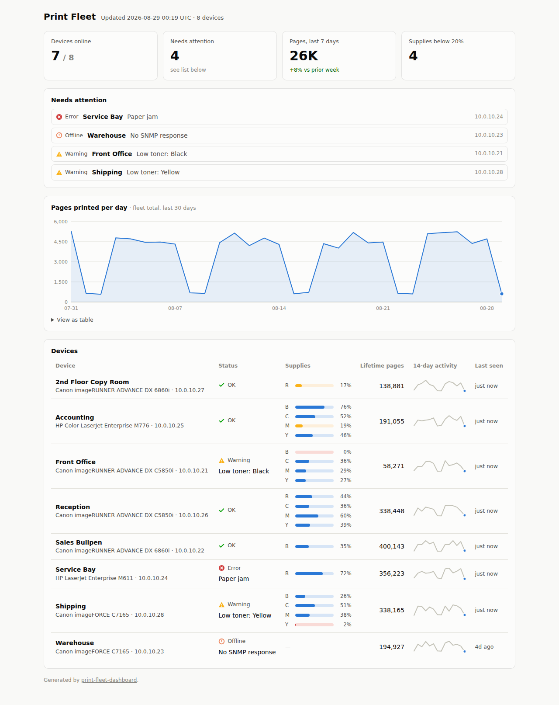

# Print Fleet Dashboard

Monitor a fleet of network printers and MFPs — toner levels, page volumes, jams, and offline devices — with three small Python scripts and **zero infrastructure**: SNMP in, SQLite in the middle, one self-contained HTML file out.



<sub>Dark mode: [screenshot-dark.png](screenshot-dark.png)</sub>

Built by an IT manager who runs a Canon/HP fleet for a living and wanted the 8 a.m. answer to "which printers need attention today?" without buying a monitoring suite.

## How it works

```
collector.py  --SNMP-->  fleet.db (SQLite)  --dashboard.py-->  fleet.html
```

- **`collector.py`** polls each device using the standard Printer MIB (RFC 3805) that every network printer speaks — model, serial, status, error state, lifetime page count, and every supply slot. Each run appends a snapshot, so history accumulates.
- **`dashboard.py`** turns the database into one static HTML file: KPI tiles, a "needs attention" list, a 30-day fleet volume chart, and a per-device table with toner meters and activity sparklines. Light and dark mode, no external assets, no server required — drop it on any file share or intranet site.
- **`demo.py`** fabricates a realistic fleet (including an offline device, a jam, and a toner burner) so you can see the whole thing work before touching a real printer.

## Try it in 30 seconds (no printers needed)

```bash
python demo.py            # writes 30 days of synthetic history to fleet.db
python dashboard.py       # writes fleet.html — open it in a browser
```

## Point it at a real fleet

```bash
pip install "pysnmp>=7.1"
cp config.example.ini config.ini     # add your device IPs + SNMP community
python collector.py                  # one snapshot per device per run
python dashboard.py                  # regenerate fleet.html
```

If every device times out, check the SNMP version before anything else — Canon iR-ADV fleets commonly answer **SNMPv1 only**:

```ini
[snmp]
community = public
version = 1
```

Schedule both (cron, Task Scheduler) — e.g. collector hourly, dashboard right after:

```
0 * * * *  cd /opt/print-fleet && python collector.py && python dashboard.py --out /var/www/fleet.html
```

Prefer a live page? `python dashboard.py --serve 8080` serves a dashboard that regenerates on every refresh.

## Finding printers you have not listed

Typing every address gets old once you have more than a floor of them. Name a
place to look instead, and anything in it that answers the Printer MIB is added
and polled from then on:

```ini
[ranges]
Office     = 10.0.10.0/24              a whole subnet
Warehouse  = 10.0.20.50-10.0.20.99     a span
Spares     = 10.0.20.50-99             the same span, short form
Boardroom  = 10.0.30.15                just the one

[discovery]
rescan_hours = 24        ; 0 = only when you pass --discover
ignore = 10.0.10.99      ; found, but leave it alone
```

Found devices are named from their `sysName` (falling back to model, then the
address), remembered with the place they came from, and polled like any other.
A switch or a server that merely speaks SNMP is passed over, not recorded — an
address only counts if it answers `hrPrinterStatus` or `prtMarkerLifeCount`.

```bash
python collector.py --discover      # look now, whatever the clock says
python collector.py --no-discover   # poll what is known, look for nothing
```

**This is a scan, and it says so.** With `[ranges]` set, the collector sends an
SNMP GET to every address in them — one cheap GET, 64 at a time, one second to
answer. That is ordinary traffic on a network you run, but it is still a scan
and on some networks it will show up in monitoring; point it at your own VLANs
and tell whoever watches them. Nothing is scanned unless you name a place. A
place larger than 1024 addresses is **refused rather than attempted** (`10.0.0.0/8`
is sixteen million), and a place that cannot be parsed is reported by name
rather than quietly doing nothing — a typo you cannot see is worse than an
error you can. A place that has never been looked at is always looked at once,
so adding one is never a silent no-op.

Polling runs eight devices at a time (`poll_at_once`), so a fleet that
discovery grew does not spend one device's timeout after another.

Running this as part of the [IT Ops Console](https://github.com/JonathanT10/it-ops-console)?
You can fill in the places to look on its **Print fleet** tab instead of
editing this file, and it will show what each one found.

## What gets collected

| Field | OID | Source |
|---|---|---|
| Model | 1.3.6.1.2.1.25.3.2.1.3.1 | hrDeviceDescr |
| Serial | 1.3.6.1.2.1.43.5.1.1.17.1 | prtGeneralSerialNumber |
| Status | 1.3.6.1.2.1.25.3.5.1.1.1 | hrPrinterStatus |
| Error state | 1.3.6.1.2.1.25.3.5.1.2.1 | hrPrinterDetectedErrorState (bit-decoded: jam, door open, out of paper/toner, service…) |
| Lifetime pages | 1.3.6.1.2.1.43.10.2.1.4.1.1 | prtMarkerLifeCount |
| Supplies | 1.3.6.1.2.1.43.11.1.1.5/6/8/9 | prtMarkerSupplies table (type, description, capacity, level) |

Status rolls up to four states: **OK**, **Warning** (low paper/toner, or any supply under 10%), **Error** (jam, door open, out of paper/toner, service requested), **Offline** (no SNMP response, or no data for 48h). Page volumes are computed as day-over-day deltas of the lifetime counter, so a collector gap never fabricates volume.

## Honesty notes

- Tested against **real hardware** (a Canon iR-ADV fleet: models, serials, lifetime page counts, per-cartridge toner all verified against the devices' own web panels) as well as simulated devices and synthetic data. The Printer MIB is well standardized, but vendors have quirks — if your device reports supplies in `-2`/`-3` (unknown / "some remaining"), the dashboard shows a dash rather than guessing. Canon reports drum and waste-toner units that way, for example.
- **Toner percentages are exact.** Device web panels typically round up to the nearest 10%; this reads the raw MIB values, so 41% here shows as "50%" on the panel. Neither is wrong — this one is just finer-grained.
- **SNMPv1 and v2c** are both supported (`version = 1` in `[snmp]` for the many Canon iR-ADV devices that answer v1 only and silently ignore v2c). A community string is the whole auth story either way — fine on a management VLAN, not something to expose broadly. SNMPv3 is on the roadmap.
- Read-only by design: the collector only ever issues SNMP GET/WALK.
- **One slow printer can't wedge the run.** Each device poll has a hard wall-clock ceiling on top of the per-request SNMP timeout, so an unresponsive or flaky printer is recorded offline and the poll moves straight on — it never hangs the collector. Tune it with `device_timeout` in `[snmp]`; `tests/test_timeout.py` proves a hanging device gives up near the deadline.
- **A missing SNMP library is never reported as an offline printer.** If `pysnmp` cannot be imported, the collector stops before it opens the database: nothing is polled, no snapshot is written, no device is marked offline, and it exits `3` so the caller knows the fleet was not checked at all. This matters most on a schedule — a job that runs as a service account cannot see a library installed under one person's account, and the old code turned that into three healthy printers reported offline, every morning, with an exit code of 0. `tests/test_snmp_missing.py` proves nothing is recorded and that a genuinely unreachable printer is still recorded offline.
- **Printer-supplied text is treated as data, never markup.** A device sets its own name and description, so the dashboard escapes every SNMP-sourced value before it reaches the page — a printer named `<script>…` renders as that literal text, it does not run. `tests/test_xss.py` executes a deliberately hostile fleet in a browser and asserts nothing injected fires.

## Roadmap

- SNMPv3
- Ping-first discovery, for ranges where most addresses are empty
- Per-device cost tracking (price per cartridge → cost per page)

## Related tools

Same author, same philosophy (small, honest, no infrastructure): [entra-lifecycle-toolkit](https://github.com/JonathanT10/entra-lifecycle-toolkit) · [m365-license-waste-report](https://github.com/JonathanT10/m365-license-waste-report)

## License

MIT — see [LICENSE](LICENSE).
